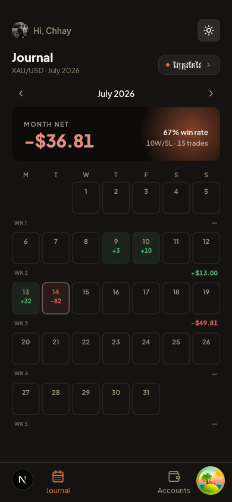
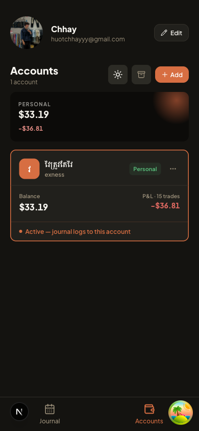
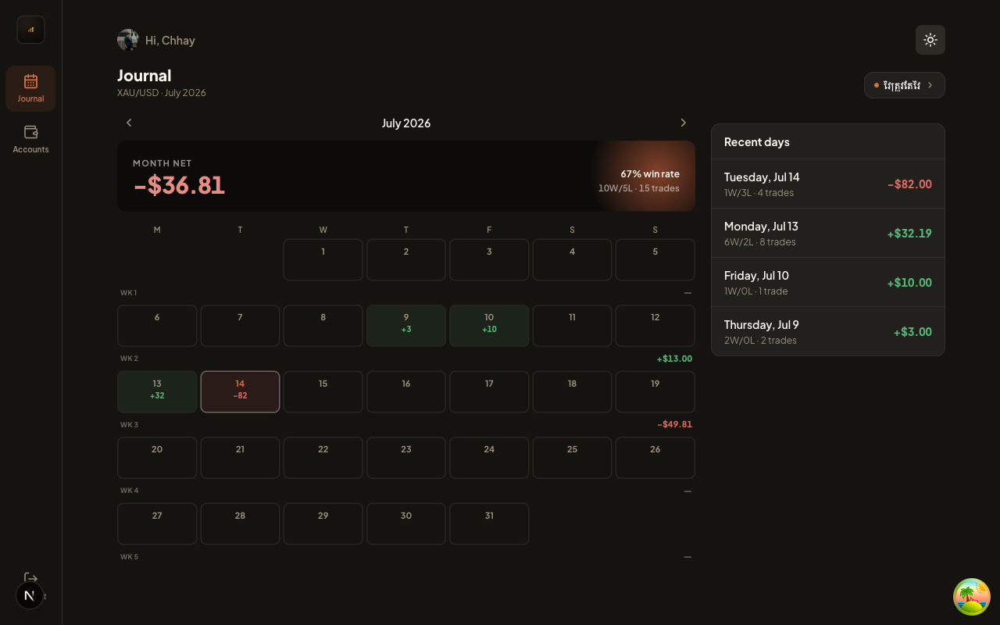
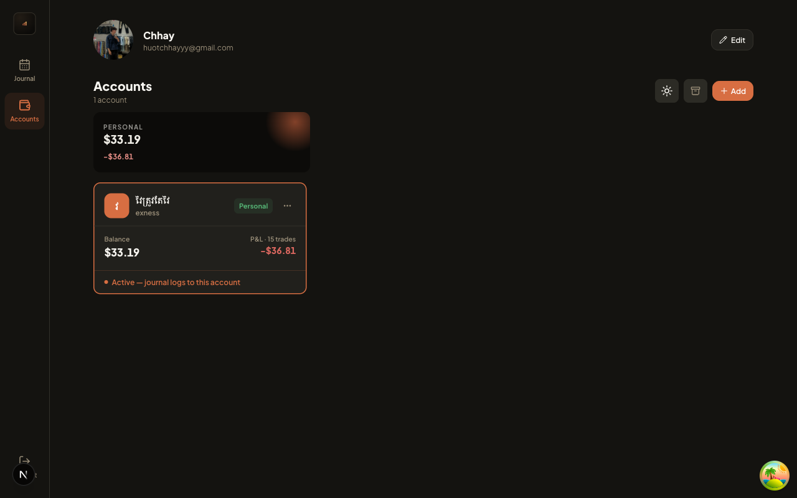

# Pipfolio

A mobile-first XAU/USD trading journal. Log daily P&L, browse a monthly calendar
of results, track multiple trading accounts (personal / funded / demo), and see
win rate and net P&L at a glance — without ever blending money across account
types that don't belong together.

<p align="center">
  
  
</p>

Tablet and desktop get a sidebar nav, a wider layout, and a "Recent days" panel next to the calendar:

<p align="center">
  
</p>
<p align="center">
  
</p>

## Features

- **Monthly journal calendar** — every day colored by win/loss, with a
  month-net P&L and win-rate summary up top
- **Quick Log** — log a day's result (win/loss + P&L) from a bottom sheet in
  a couple of taps
- **Multiple trading accounts** — personal, funded, and demo accounts, each
  with its own balance and trade history; create, rename, and delete accounts
  from the Accounts screen
- **Type-segregated totals** — personal, funded, and demo balances/P&L are
  always shown and summed separately, since combining a funded account with
  personal capital would misrepresent what's actually at risk
- **Persisted account selection** — the account you're journaling against is
  remembered across visits (localStorage)
- **Responsive** — mobile-first, with a dedicated tablet/desktop layout
  (sidebar nav, wider grids, a "Recent days" panel next to the calendar)
- **Profile header on Accounts** — avatar (with upload), name, and email; edit name and photo in a bottom sheet
- **Dark, warm "paper & clay" theme** with light mode support

## Tech stack

- [Next.js 16](https://nextjs.org) (App Router, Turbopack, Server Actions)
- [better-auth](https://www.better-auth.com) for authentication
- [Drizzle ORM](https://orm.drizzle.team) on Postgres
- [TanStack Query v5](https://tanstack.com/query/latest) for server state
- [Zustand](https://zustand.docs.pmnd.rs) for client/domain state
- [React Hook Form](https://react-hook-form.com) + [Zod](https://zod.dev) for every form
- [Tailwind CSS v4](https://tailwindcss.com) + [shadcn/ui](https://ui.shadcn.com) (New York style)

## Architecture

Business logic is organized by feature, not by technical layer — each domain
owns its actions, components, hooks, schemas, and store:

```
src/features/<domain>/
  actions/      ← server actions ('use server')
  components/   ← feature UI
  hooks/        ← TanStack Query hooks
  schemas/      ← Zod schemas + inferred types for forms
  store/        ← Zustand store (client-only domain state)
  types.ts
  utils/        ← domain-aware helpers
```

Slices (`auth`, `accounts`, `trades`, `journal`) never import from each other —
shared code lives in `src/components/shared/` or `src/lib/`.

See [CLAUDE.md](./CLAUDE.md) for the full architectural rulebook (naming
conventions, dependency rules, TypeScript strictness, etc.).

## Quickstart

Needs a Postgres database — any reachable instance works (a local install, or
a free hosted one like Neon, Supabase, or Railway).

```bash
npm install
cp .env.local.example .env.local   # fill in DATABASE_URL and BETTER_AUTH_SECRET
npm run db:generate && npm run db:migrate
npm run dev                        # http://localhost:3000
```

Visit `/register` to create an account, then `/journal` to start logging trades.

Other commands:

```bash
npm run build     # production build (also runs tsc + lint)
npm run lint      # ESLint only
npx tsc --noEmit  # type check only
npm run db:studio # Drizzle Studio
```

## License

Copyright © 2026 Chhay. All rights reserved.
